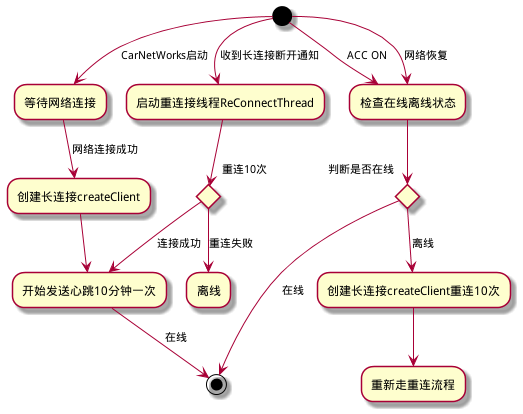

# CarNetWorks 长连接基本流程
---
## 1:创建长连接
   系统自动启动app,在CarNetWorks主服务中启动mNetWorkRYConnectThread等待网络连接.在网络连接成功之后,
创建长连接.

```
while(!state){
           LogUtils.d("NetWorkRYConnectThread Network is unconnect, sleep 3s " );
           try {
               Thread.sleep(3000);
           }catch (InterruptMedException e){

           }
           state = NetworkUtil.isNetworkAvailable(CarSystemServer.this);
       }


ClientConnect.getInstance().createClient(CarSystemServer.this);
ClientConnect.getInstance().ResetLoginTime();

```

## 2:维持心跳
    在收到服务器的注册成功指令之后,发送心跳,间隔10min一次.

```
public  class AlarmReceiver extends BroadcastReceiver {
    @Override
    public void onReceive(Context context, Intent intent) {
        if(channel != null) {
            LogUtils.d(TAG,"AlarmReceiver heart 10min start..channel is ok open:"+channel.isOpen() +" active:"+channel.isActive() +" address = " +channel.localAddress()) ;
            channel.writeAndFlush(beatjson);
            LogUtils.d(TAG,"AlarmReceiver heart 10min end..");
        }else{
            LogUtils.d(TAG,"AlarmReceiver heart 10min..channel is null");
        }

        AlarmManager am = (AlarmManager)CarServiceClient.getContext().getSystemService(CarServiceClient.getContext().ALARM_SERVICE);

        if(mPendingIntent != null) {
            LogUtils.d(TAG," start a  new setExactAndAllowWhileIdle....");
            am.setExactAndAllowWhileIdle(AlarmManager.ELAPSED_REALTIME_WAKEUP,
                    SystemClock.elapsedRealtime() + CLIENT_TIME, mPendingIntent);
        }
    }
}
```

## 3:断线重连
   车机收到服务器的断开动作,启动重 线程ReConnectThread,没10秒重连一次,总结10次.重连不上,连接中断

```
private class ReConnectThread extends Thread {

        @Override
        public void run() {
            LogUtils.d(TAG,"Thread tryConnect:"+ tryConnect.incrementAndGet() );
            if(tryConnect.get()>1000){
                tryConnect = new AtomicInteger(0);
            }
            while(!isInterrupted){
                if( connectIndex++ > RECONNENT_TIME){
                    LogUtils.d(TAG,"重连失败......connectIndex:"+connectIndex );
                    break;
                }
                createClient(null);
                LogUtils.d(TAG,"重连中......connectIndex:" + connectIndex);

                try {
                    Thread.sleep(RE_CLIENT_TIME);
                    LogUtils.d(TAG,"Thread.sleep:" + RE_CLIENT_TIME +" ms over");
                }catch (InterruptedException e){
                    LogUtils.d(TAG,"Thread.sleep Exception");
                    isInterrupted =true;
                }
            }
            mReConnectThread =null;
        }
    }

```
## 4:网络波动重连
   在CarNetWorks收到网络可用时,重新建立长连接.
   ```
   private class ConnectBroadcastReceiver extends BroadcastReceiver {
       @Override
       public void onReceive(Context context, Intent intent) {
           String action = intent.getAction();
           if (action.equals(ConnectivityManager.CONNECTIVITY_ACTION)) {
               boolean isAvailable = NetworkUtil.isNetworkAvailable(context);
               int acc = CarServiceClient.getAccStatus();
               String temp = (acc == Config.System.ACC_ON ? "ACC_ON" : "ACC_OFF");
               LogUtils.d("connectivity receiver acc:" + temp + ",isAvailable:" + isAvailable);
               if (isAvailable && acc == Config.System.ACC_ON) {
                 LogUtils.d("connectivity receiver 网络波动、恢复正常，同步数据");

               //检测连接
               if(ClientConnect.getInstance().getChannel()!= null
                       &&!ClientConnect.getInstance().getChannel().isActive()){
                   LogUtils.d("connectivity 重新注册连接......");
                   ClientConnect.getInstance().createClient(CarSystemServer.this);
                   rongYunConnect();
               }
               }

               //need checkry
           }
       }
   }
   ```
## 5:点火重连
  CarNetWorks在检测到ACC ON,并且网络可用的情况下,重建长连接.
```
@Override
   public void onAccStatusChanged(int status) {
       if (status == Config.System.ACC_ON) {
           LogUtils.d("acc status change to ACC_ON");
            ...

           if(NetworkUtil.isNetworkAvailable(context)) {
               if (ClientConnect.getInstance().getChannel() != null
                       && !ClientConnect.getInstance().getChannel().isActive()) {
                   LogUtils.d("ACC_ON connectivity createClient......");
                   ClientConnect.getInstance().createClient(CarSystemServer.this);
               }


               AutoManagement.newInstance(context).registerCar(
                       (String) SPUtils.get(context, Config.JP_ID, ""),
                       CarSystemServer.this);
           }
           ClientConnect.getInstance().ResetLoginTime();

       }
       CanBusNettyManager.getInstance().postAccInfoByCanBusCMD(status);
   }

```

# 长连接流程图
---

---
