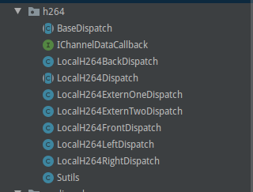

# WaterWorld 平台H264数据获取方法

## 1.复制Demo app中整个h264文件夹到自己的工程中

## 2.实现数据回调接口

      public interface IChannelDataCallback {
           void inputH264Nalu(int channel, byte[] nalu, int naluLength) ;
      }

## 3.注册数据回调,并且启动
   * 每一路数据需要分别调用

         case AppConfig.FRONT:
                  mBaseDispatch = new LocalH264FrontDispatch(this, NativeWindowActivity.this);
                  mBaseDispatch.start();  //data not come form PreViewCallback
              break;
          case AppConfig.BACK:
                  mBaseDispatch = new LocalH264BackDispatch(this, NativeWindowActivity.this);
                  mBaseDispatch.start();  //data not come form PreViewCallback
              break;
          case AppConfig.LEFT:
                  mBaseDispatch = new LocalH264LeftDispatch(this, NativeWindowActivity.this);
                  mBaseDispatch.start();  //data not come form PreViewCallback
              break;
          case AppConfig.RIGHT:
                  mBaseDispatch = new LocalH264RightDispatch(this, NativeWindowActivity.this);
                  mBaseDispatch.start();  //data not come form PreViewCallback
              break;
          case AppConfig.EXTERN_ONE:
                  mBaseDispatch = new LocalH264ExternOneDispatch(this, NativeWindowActivity.this);
                  mBaseDispatch.start();  //data not come form PreViewCallback
              break;
          case AppConfig.EXTERN_TWO:
                  mBaseDispatch = new LocalH264ExternTwoDispatch(this, NativeWindowActivity.this);
                  mBaseDispatch.start();  //data not come form PreViewCallback
              break;

  * 其中6路数据别对应如6个类

        LocalH264FrontDispatch
        LocalH264BackDispatch
        LocalH264LeftDispatch
        LocalH264RightDispatch
        LocalH264ExternOneDispatch
        LocalH264ExternTwoDispatch

## 4.数据回调
   * 每一贞数据到来会通过 inputH264Nalu 回调给app,注意inputH264Nalu 函数中不要做耗时操作,
   否则会丢贞.

     @Override
      public void inputH264Nalu(int channel, byte[] nalu, int naluLength) {

               if(channel == mCurrentShow) {
                   H264Utils.log2FileOnlyhex(nalu, naluLength);
               }
      }

   * 其中 channel 对应通道如下

      public static final int LOCAL_H264_FONT_TYPE = 0;
      public static final int LOCAL_H264_BACK_TYPE = 1;
      public static final int LOCAL_H264_LEFT_TYPE = 2;
      public static final int LOCAL_H264_RIGHT_TYPE = 3;
      public static final int LOCAL_H264_EXTERN_ONE = 4;
      public static final int LOCAL_H264_EXTERN_TWO = 5;

## 5.停止数据
  * 调用如下函数停止获取数据,在异常处理和退出的时候,一定要调用对应通道的destroy方法.

        mDisptach.destroy();

## 6.注意事项

  * 调用如下函数取数据的时候,需要使用naluLength参数作为数据长度,不要使用nalu.length.

  public void inputH264Nalu(int channel, byte[] nalu, int naluLength) ;
